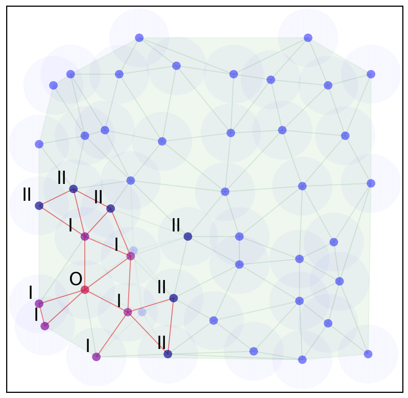

 

<h1 align="center">Distributed Algorithm - Leader Election</h1>

     <h4 align="center">This project simulates the Bully Algorithm for leader election in distributed systems using a client-server architecture in Java. The implementation showcases how clients and a server interact to dynamically elect a leader among connected nodes.
     </h4> 
     

-----------------------------------------
### Overview
This project provides a practical implementation of the Bully Algorithm, a method used in distributed systems to elect a coordinator or leader among several networked computers.
It consists of two main Java classes: Client.java and Server.java. The simulation is structured around a client-server architecture where multiple clients (nodes) communicate through
a central server to manage and coordinate the process of leader election.
The interaction between clients and the server not only facilitates the basic operation of the Bully Algorithm but also demonstrates how leader election can be dynamically managed in a networked environment, handling joins and departures of nodes smoothly and efficiently.

-----------------------------------------

### Implementation

* **Client Component:** Each client initializes a connection to the server using TCP/IP protocols, receives a unique identifier (ID), and periodically sends "alive" messages to the server to assert its availability. These messages are also crucial triggers for the leader election process whenever the current leader fails or disconnects. Clients listen for messages from the server, particularly to recognize when a new leader is elected or when they themselves are elected as leaders.
* **Server Component:** The server acts as the central coordinator. Upon startup, it waits for client connections, assigns them an ID, and listens to their messages. When a client sends an "alive" message, the server may initiate a leader election process if the conditions imply a need for a new leader (e.g., the disconnection of the current leader). The server uses a locking mechanism to ensure that the leader election process is synchronized across multiple threads, preventing race conditions and ensuring that the highest available client ID is chosen as the new leader.
* **Concurrency:** Utilized ConcurrentHashMap for managing clients and ReentrantLock for handling synchronization during leader elections, ensuring thread safety.
* **Communication:** Clients and server communicate via TCP sockets, with data sent in UTF format. This setup ensures reliable and ordered message delivery, which is critical for accurate leader elections.
* 
-----------------------------------------

### Challenges Faced

* **Handling Concurrent Connections:** Ensuring that multiple clients could connect and communicate simultaneously without data loss or corruption was challenging. This required careful management of threads and shared resources.
* **Leader Election Coordination:** Implementing the election logic to correctly and efficiently select a new leader when the current leader disconnects was complex, especially in handling edge cases where multiple elections could occur simultaneously.
* **Network Reliability Simulation:** Simulating network issues such as client disconnections and message losses to test the robustness of the election process added an additional layer of complexity.

-----------------------------------------

### Screenshots
